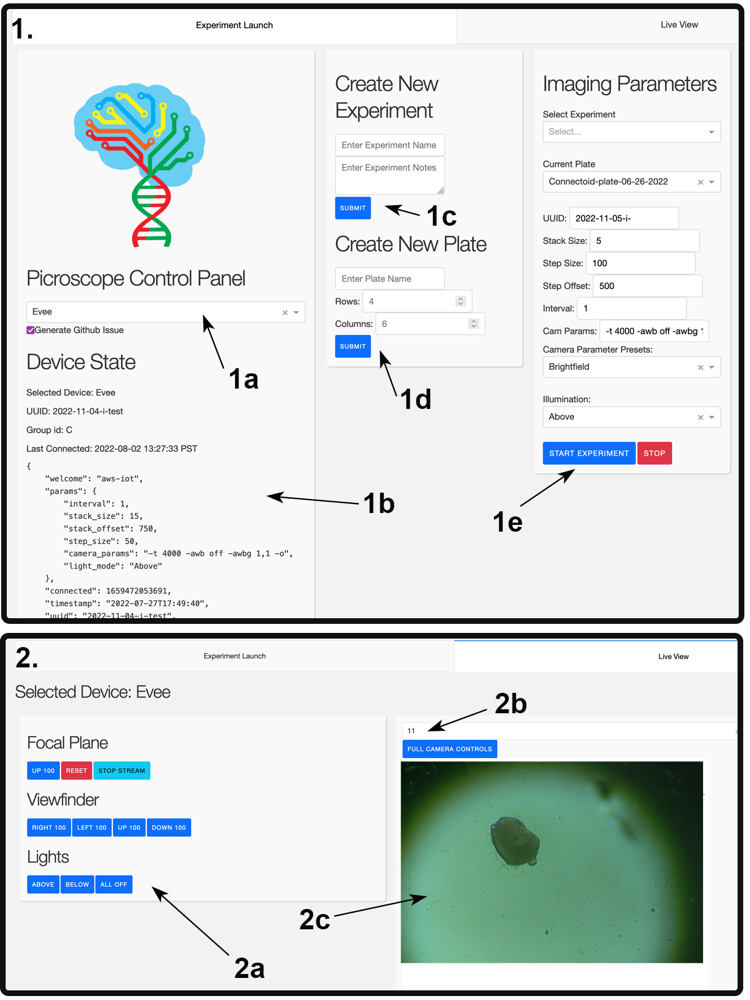

## Plotly Dash based Control Console for Picroscope type devices


 
 1: Experiment Setup View, the device selection dropdown menu (1a) populates the Device State field (1b) with data from the Things database, Here you can define new experiments (1c) and plates (1d), these objects generate entries in the database, The Imaging Parameters section (1e) is where we set parameters like z-stack size and image capture interval; 2: Live View, Here we can see a live view of any of the cameras in the system and adjust focus or XY plate position. The panel at (2a) allows users to toggle lights and adjust plate position to capture the best possible data. The camera dropdown menu (2b) allows users to select which camera to view. and 2c shows the live view of the selected camera.

## Setup

Requires credentials file in the default aws format (.aws/credentials) also a file users.py with the following format:

```python
#user dictionary
USERNAME_PASSWORD_PAIRS = {
     'username': 'passwords'
}
PISCOPE_BOT_TOKEN = "access-token-for-github-issues-bot"
```

.env file looks something like:

```
LIVESTREAM_ENDPOINT = https://braingeneers.gi.ucsc.edu/stream/
BASE_URL_PATH = /picroscope/
BASE_URL = http://0.0.0.0:8056

```
Livestream endpoint must be configured for your own build. Livestream system based on [this repo](https://github.com/pvbaudin/Raspberry-Pi-Livestream-Tunnel)
